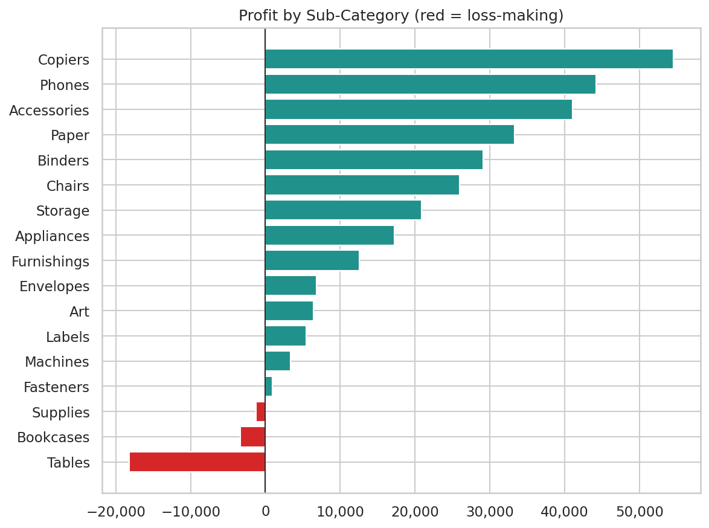
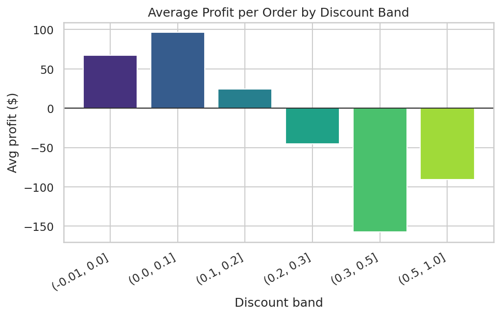
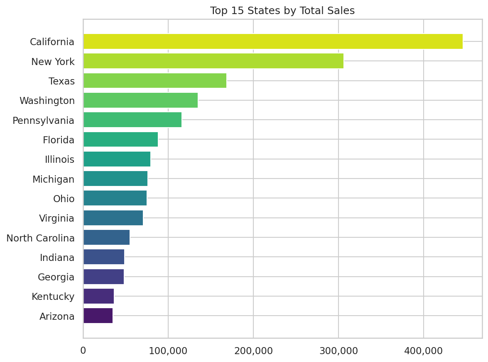
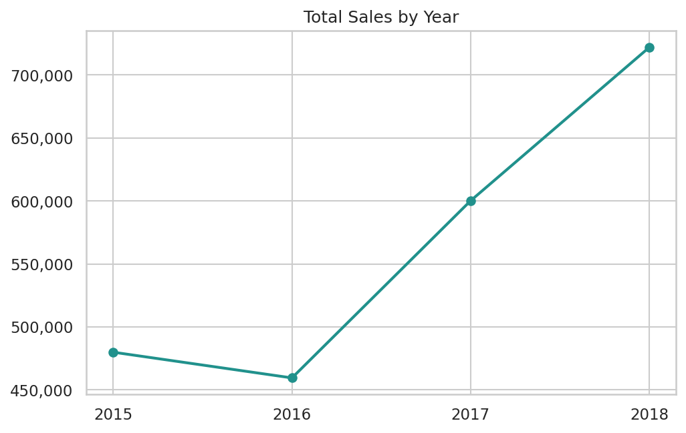
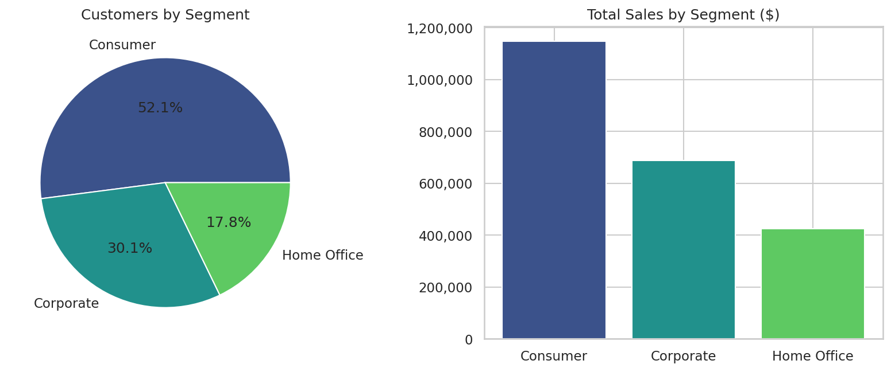

# 📊 SuperStore Sales & Profitability Analysis

[](https://www.python.org/)
[](https://pandas.pydata.org/)
[](https://streamlit.io/)
[](https://plotly.com/)
[](LICENSE)

An end-to-end exploratory data analysis of ~9,800 orders from a US retail superstore (2015–2018), going beyond a revenue-only view to find where the business is actually **profitable** — and where it isn't. Includes a Jupyter notebook, a reusable analysis script, and a live interactive Streamlit dashboard.

**[▶ Live dashboard](#-interactive-dashboard)** &nbsp;•&nbsp; **[📓 Notebook](notebooks/SuperStore_Sales_Analysis.ipynb)** &nbsp;•&nbsp; **[📄 One-page summary](reports/Executive_Summary.pdf)**

---

## Table of Contents

- [Project Purpose](#-project-purpose)
- [Key Findings](#-key-findings)
- [Interactive Dashboard](#-interactive-dashboard)
- [Repository Structure](#-repository-structure)
- [Tech Stack](#️-tech-stack)
- [How to Run](#-how-to-run)
- [Data & Methodology](#-data--methodology)
- [Further Improvements](#-further-improvements)

---

## 📌 Project Purpose

Most public "Superstore" EDA projects stop at *"which category sells the most?"*. This one goes a step further and asks the questions a business stakeholder actually needs answered:

- Which customer segments and individuals generate the most **revenue and lifetime value** — not just the most orders?
- Which product categories are **genuinely profitable**, and which are quietly losing money?
- Does **discounting help or hurt** the bottom line, and at what threshold does it flip?
- Which regions look strong on sales but are **actually unprofitable**?
- How has the business trended year over year, and what's the seasonal pattern?

---

## 💡 Key Findings

| Metric | Value |
|---|---|
| Total Sales | **$2.26M** |
| Total Profit | **$278,979** |
| Overall Profit Margin | **12.3%** |
| Orders / Unique Customers | **4,922 / 793** |
| Repeat Customer Rate | **98.4%** |

**1. Furniture is a volume trap.** It's the #2 category by revenue but dead last by profit — Tables (-9.0% margin) and Bookcases (-3.0% margin) are outright loss-making.



**2. Discounts above ~20% destroy profit.** Average profit per order goes negative once discount exceeds 0.2, and the 30-50% band loses ~$157 per order on average.



**3. Texas, Ohio, Pennsylvania and Illinois are profitability blind spots** — all top-10 states by sales, all net-negative on profit.



**4. Growth resumed strongly after a 2016 dip:** sales fell 4.3% in 2016, then grew 30.6% (2017) and 20.3% (2018).



**5. Customer segmentation & CLTV:** Consumers are the largest segment by headcount and revenue, but Corporate customers carry the highest average lifetime value per customer.



Full workings, RFM customer tiering, shipping-mode analysis, and the discount/geography/time-series breakdowns are in the [notebook](notebooks/SuperStore_Sales_Analysis.ipynb).

---

## 🖥️ Interactive Dashboard

A Streamlit dashboard lets you filter by date range, segment, category and region, with live KPIs, profitability breakdowns, a US profit/sales choropleth, and time-trend charts.

```bash
streamlit run dashboard/app.py
```

*(To deploy publicly and get a shareable link: push this repo to GitHub, then deploy for free at [share.streamlit.io](https://share.streamlit.io) pointing at `dashboard/app.py`. Add the live link here once deployed.)*

---

## 📁 Repository Structure

```
.
├── data/
│   ├── superstore_sales.csv       # cleaned, enriched dataset
│   └── README.md                  # data dictionary + enrichment methodology
├── notebooks/
│   └── SuperStore_Sales_Analysis.ipynb
├── scripts/
│   └── run_analysis.py            # reusable script: cleans data, computes metrics, saves charts
├── dashboard/
│   └── app.py                     # Streamlit dashboard
├── reports/
│   ├── metrics.json               # all computed KPIs, machine-readable
│   ├── rfm_customer_segments.csv  # per-customer RFM scores/tiers
│   ├── subcategory_profitability.csv
│   └── Executive_Summary.pdf      # one-page recruiter-friendly summary
├── assets/images/                 # chart exports used in this README
├── requirements.txt
└── LICENSE
```

---

## ⚙️ Tech Stack

- **Python** (Pandas, NumPy) — data cleaning and analysis
- **Matplotlib / Seaborn** — static charts
- **Plotly** — interactive choropleth, sunburst and treemap visualizations
- **Streamlit** — interactive dashboard
- **Jupyter Notebook** — primary analysis narrative

---

## 🚀 How to Run

```bash
git clone https://github.com/SubhranshuPan/Super-Store-Data-Analysis-Project.git
cd Super-Store-Data-Analysis-Project
python -m venv .venv && source .venv/bin/activate   # optional but recommended
pip install -r requirements.txt

# Reproduce all metrics + chart images
python scripts/run_analysis.py

# Explore the full narrative notebook
jupyter notebook notebooks/SuperStore_Sales_Analysis.ipynb

# Launch the interactive dashboard
streamlit run dashboard/app.py
```

---

## 🗂️ Data & Methodology

The base dataset ships with order, customer, product and geography attributes plus `Sales`, but not `Profit`, `Discount` or `Quantity`. Those three fields were sourced from the public "Sample – Superstore" reference dataset and merged in on `Row ID`, after verifying an exact match on `Product ID`/`Customer Name`/`Sales` for every row. Full details in [`data/README.md`](data/README.md).

---

## 🔭 Further Improvements

- [ ] Deploy the dashboard to Streamlit Community Cloud and link it here
- [ ] Add a lightweight sales-forecasting model (e.g. Prophet or SARIMA) on top of the monthly trend
- [ ] Add automated tests for the cleaning/aggregation functions in `scripts/run_analysis.py`
- [ ] Add a GitHub Actions workflow to re-run `scripts/run_analysis.py` and lint on every push
- [ ] Package the dataset load/clean logic as an importable module rather than duplicated notebook/script code

---

## 📬 Contact

**Subhranshu Panda** — [GitHub](https://github.com/SubhranshuPan) · open to Data Analyst / Data Science part-time and internship roles.
